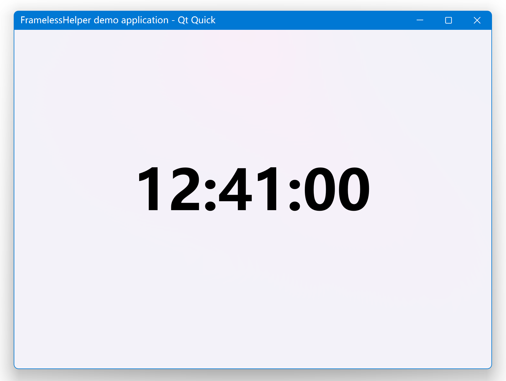
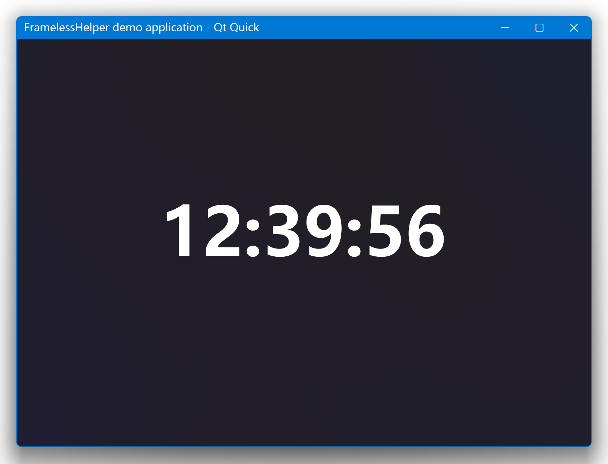
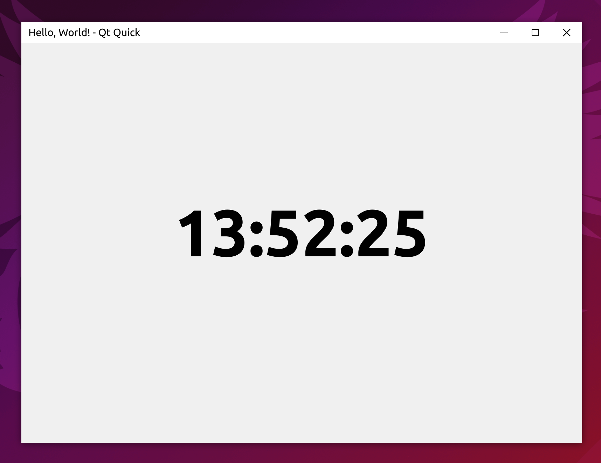
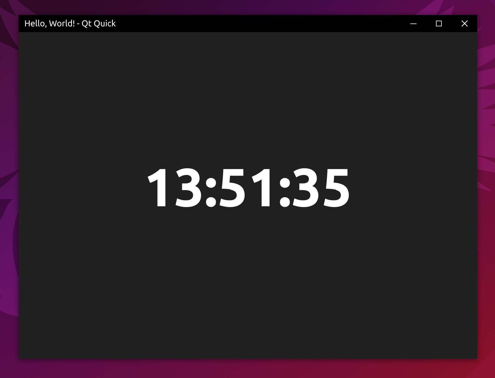
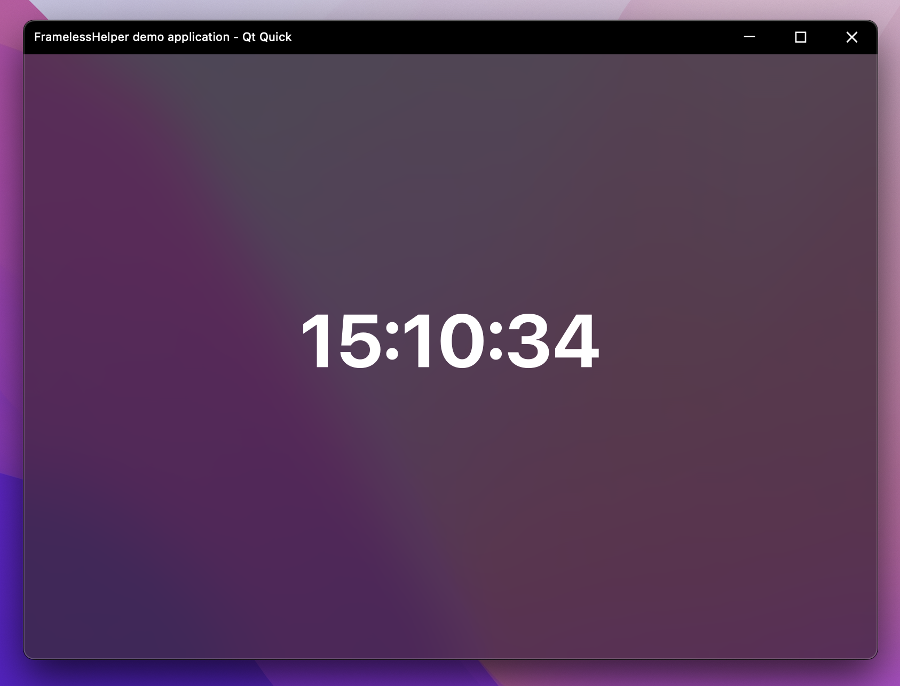
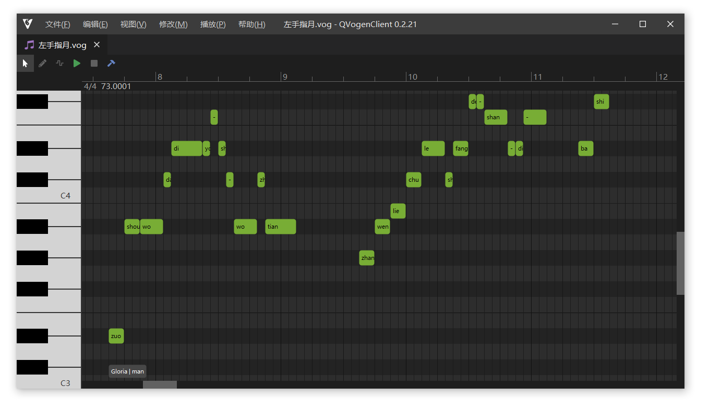

# FramelessHelper 2.x

[](https://github.com/wangwenx190/framelesshelper/actions/workflows/ci.yml)

Cross-platform window customization framework for Qt Widgets and Qt Quick. Supports Windows, Linux and macOS.

## Join with Us :triangular_flag_on_post:

You can join our [Discord channel](https://discord.gg/grrM4Tmesy) to communicate with us. You can share your findings, thoughts and ideas on improving / implementing FramelessHelper functionalities on more platforms and apps!

## HELP WANTED!

1. The current CMake package code is not complete and still has some small issues. Need some experienced CMake developers to help me improve it!
2. The current Linux/X11 implementation is not stable enough and still has some bugs. Need some experienced Linux developers to help me improve it!
3. The current macOS implementation is not stable enough and still has some bugs. Need some experienced macOS developers to help me improve it!

## Roadmap

- Common: Add cross-platform customizable system menu for both Qt Widgets and Qt Quick. Also supports both light and dark theme.
- Examples: Add QtWebEngine based demo projects for both Qt Widgets and Qt Quick. The whole user interface will be written in HTML instead of C++/QML.
- Examples: Add demo projects that emulate the classic appearance of UWP applications. They will have a backward button on the left side of the title bar and a search box in the middle of the title bar. And maybe a side bar on the left side to switch between different pages.
- Examples: Add demo projects that the main window is not resizable.
- Examples: Add demo projects that have transparent background and doesn't have rectangular window frame.
- Feature requests are welcome!

## Highlights v2.3

- Widgets & Quick: When you clicks the window icon, the system menu will now popup, and when you double clicks it, the window will be closed. This emulates the traditional window behavior on Windows.
- Widgets & Quick: The StandardSystemButton's icon size can't be changed due to I forgot to implement such funtionality, it's implemented now.
- Widgets: Added `FramelessDialog` class. You can use it in case a `QDialog` is preferred over a general `QWidget`.
- Widgets: The StandardSystemButton's size can't be changed due to a FramelessHelper bug, it's fixed now.
- Widgets: Added public interface to change the title label font (family, point size, style, etc...).
- Widgets: The window borders are now drawn by the newly introduced `WindowBorderPainter` class, and it's also exposed publicly, so you'll be able to change how we draw the window border easily.
- Quick: Added `WindowBorder` element. It's a cross-platform window border decorator, and can work without the `FramelessHelper` element.
- Quick: Added `FramelessApplicationWindow` element. It's a simple wrapper of the standard `ApplicationWindow` element, just removes the title bar and adds the window border.
- Windows: Added support for dark theme system menu. The system menu triggered by right-clicking on the title bar will now use the same theme with the current system theme, and will switch between light and dark theme automatically.
- macOS: Added support for old macOS versions and old Qt versions, in theory.
- Common: Internal code improvements & bug fixes.

## Highlights v2.2

- Common: Added blur behind window feature for Windows (7\~11), Linux and macOS. On Windows 11 and macOS, FramelessHelper will make use of the blur effect provided by the OS to get the best appearance and performance, while on Windows 7\~10 and Linux, FramelessHelper will use a homemade blur effect to provide as much consistent experience as possible.
- Common: Added window icon support. It's now possible to set the window icon's image, size and visibility for the standard title bar control.
- Windows: If you are using Qt 6.4+, your Qt Widgets applications will now automatically switch to light/dark theme if the OS theme changes. It requires you are using the default palette provided by Qt. Qt Quick applications will not be affected.
- Linux: FramelessHelper is now theme-aware. If you change your OS theme, FramelessHelper will now emit the theme change signal and refresh it's internal palette.
- Build system: Implemented CMake package support. It's now possible to use `find_package` to find FramelessHelper.
- Build system: Implemented limited QMake support. FramelessHelper doesn't provide complete QMake project, to decrease the maintainance burden, but you can use the .pri files to directly embed FramelessHelper into your own application.
- Examples: Enabled blur behind window and round window corner by default.
- Common: Migrated to categorized logging output. You can now enable or disable some specific debug messages using QLoggingCategory.
- Common: Internal code improvements & bug fixes.

## Highlights v2.1

- Windows: Added support for the snap layout feature introduced in Windows 11.
- Widgets: Redesigned the public interface, the use of FramelessHelper is now more elegant.
- Quick: Redesigned the public interface, the use of FramelessHelper is now more elegant.
- Common: Redesigned the standard title bar interface, it's now possible to customize it from outside. Previously there's no standard title bar in the widgets module, it's now added and exported.
- Doc: Add initial simple documentation to show how to use this library for both Qt Widgets and Qt Quick.
- Misc: Removed bundled Qt internal classes that are licensed under Commercial/GPL/LGPL. This library is now pure MIT licensed.
- Misc: Bug fixes and internal refactorings.

## Highlights v2.0

- Windows: Gained the ability to only remove the title bar but preserve the window frame at the same time.
- Windows: The flicker and jitter during window resizing is completely gone.
- Windows: The system menu will be opened if you right-click on your custom title bar.
- Windows: Replaced Qt's original system menu with FramelessHelper's homemade one, which looks a lot better than the original one.
- Linux: Removed the limitation of the Qt version. The minimum supported version is lowered to Qt 5.6 now (previously was 5.15).
- macOS: Removed the limitation of the Qt version. The minimum supported version is lowered to Qt 5.6 now (previously was 5.15).
- macOS: The frameless window now supports native resizing.
- Common: Almost completely rewritten of the whole library, it's now a lot more easier to setup your own custom title bar than before.
- Common: Added many more helper functions to allow creating your own custom window easier.
- Misc: Reorganized the project structure to be more like a modern library, it's now a lot more friendly to the library users.
- Misc: Many bugs from the 1.x times are fixed (they were not fixable in 1.x due to technical reasons).

## Screenshots

### Windows





### Linux





### macOS




## Use Cases

### QVogenClient



Vogen editor using **QSynthesis** framework. Repository URL: <https://gitee.com/functioner/qvogenclient>.

## Requiredments

- Compiler: a modern compiler which supports C++17 at least. Tested on MSVC 2022 (Windows), GCC 11 (Linux) and Clang 13 (macOS).
- Qt version: using the latest stable version of Qt is highly recommended, the minimum supported version is Qt 5.6. However, if you are using some old Qt versions (such as older than 5.12), some features may not be available. Only Qt 5.15 and Qt 6 are actively tested.
- Qt modules: QtCore and QtGui for the core module; QtWidgets for the widgets module; QtQuick, QtQuickControls2 and QtQuickTemplates2 for the quick module.
- CMake & ninja: the newer, the better. Other build systems are not tested.

## Supported Platforms

- Windows: Windows 7, Windows 8, Windows 8.1, Windows 10, Windows 11 (only actively tested on Windows 10 & 11)
- Linux: any modern Linux distros should work, but only tested on Ubuntu 20.04 and Ubuntu 22.04
- macOS: only tested on macOS 12.3 due to lack of Apple devices

There are some additional restrictions for each platform, please refer to the _Platform notes_ section below.

## Build

```bash
git clone https://github.com/wangwenx190/framelesshelper.git
mkdir A_TEMP_DIR
cd A_TEMP_DIR
cmake -DCMAKE_PREFIX_PATH=<YOUR_QT_SDK_DIR_PATH> -DCMAKE_INSTALL_PREFIX=<WHERE_YOU_WANT_TO_INSTALL> -DCMAKE_BUILD_TYPE=Release -GNinja <PATH_TO_THE_REPOSITORY>
cmake --build . --config Release --target all --parallel
cmake --install . --config Release --strip
```

**IMPORTANT NOTE**: On Linux you need to install the _GTK3_ and _X11_ development packages first.

Once the compilation and installation is done, you will be able to use the `find_package(FramelessHelper REQUIRED COMPONENTS Core Widgets Quick)` command to find and link to the FramelessHelper library. But before doing that, please make sure CMake knows where to find FramelessHelper, by passing the `CMAKE_PREFIX_PATH` variable to it. For example: `-DCMAKE_PREFIX_PATH=C:/my-cmake-packages;C:/my-toolchain;etc...`. Build FramelessHelper as a sub-directory of your CMake project is of course also supported. The supported FramelessHelper target names are `FramelessHelper::FramelessHelperCore`, `FramelessHelper::FramelessHelperWidgets` and `FramelessHelper::FramelessHelperQuick`.

## Use

### Qt Widgets

To customize the window frame of a QWidget, you need to instantiate a `FramelessWidgetsHelper` object and then attach it to the widget's top level widget, and then `FramelessWidgetsHelper` will do all the rest work for you: the window frame will be removed automatically once it has been attached to the top level widget successfully. In theory you can instantiate multiple `FramelessWidgetsHelper` objects for a same widget, in this case there will be only one object that keeps functional, all other objects will become a wrapper of that one. But to make sure everything goes smoothly and normally, you should not do that in any case. The simplest way to instantiate a `FramelessWidgetsHelper`
object is to call the static method `FramelessWidgetsHelper *FramelessWidgetsHelper::get(QObject *)`. It will return the handle of the previously instantiated object if any, or it will instantiate a new object if it can't find one. It's safe to call this method multiple times for a same widget, it won't instantiate any new objects if there is one already. It also does not matter when and where you call that function as long as the top level widget is the same. The internally created objects will always be parented to the top level widget. Once you get the handle of the `FramelessWidgetsHelper` object, you can call `void FramelessWidgetsHelper::setContentExtendedIntoTitleBar(true)` to let it hide the default title bar provided by the operating system. In order to make sure `FramelessWidgetsHelper` can find the correct top level widget, you should call the `FramelessWidgetsHelper *FramelessWidgetsHelper::get(QObject *)` function on a widget which has a complete parent-chain whose root parent is the top level widget. To make the frameless window draggable, you should provide a homemade title bar widget yourself, the title bar widget doesn't need to be in rectangular shape, it also doesn't need to be placed on the first row of the window. Call `void FramelessWidgetsHelper::setTitleBarWidget(QWidget *)` to let `FramelessHelper` know what's your title bar widget. By default, all the widgets in the title bar area won't be responsible to any mouse and keyboard events due to they have been intercepted by FramelessHelper. To make them recover the responsible state, you should make them visible to hit test. Call `void FramelessWidgetsHelper::setHitTestVisible(QWidget* )` to do that. You can of course call it on a widget that is not inside the title bar at all, it won't have any effect though. Due to Qt's own limitations, you need to make sure your widget has a complete parent-chain whose root parent is the top level widget. Do not ever try to delete the `FramelessWidgetsHelper` object, it may still be monitoring and controlling your widget, and Qt will delete it for you automatically. No need to worry about memory leaks.

There are also two classes called `FramelessWidget` and `FramelessMainWindow`, they are only simple wrappers of `FramelessWidgetsHelper`, which just saves the call of the `void FramelessWidgetsHelper::setContentExtendedIntoTitleBar(true)` function for you. You can absolutely use plain `QWidget` instead.

#### Code Snippet

First of all, call `void FramelessHelper::Widgets::initialize()` in your `main` function in a very early stage:

```cpp
int main(int, char **)
{
    FramelessHelper::Widgets::initialize();
    // ...
}
```

Then hide the standard title bar provided by the OS:

```cpp
MyWidget::MyWidget(QWidget *parent) : QWidget(parent)
{
    // You should do this early enough.
    FramelessWidgetsHelper::get(this)->setContentExtendedIntoTitleBar(true);
    // ...
}
```

Then let `FramelessHelper` know what should be the title bar:

```cpp
void MyWidget::myFunction()
{
    // ...
    FramelessWidgetsHelper::get(this)->setTitleBarWidget(m_myTitleBarWidget);
    // ...
}
```

Then make some widgets inside your title bar visible to hit test:

```cpp
void MyWidget::myFunction2()
{
    // ...
    FramelessWidgetsHelper::get(this)->setHitTestVisible(m_someSearchBox);
    FramelessWidgetsHelper::get(this)->setHitTestVisible(m_someButton);
    FramelessWidgetsHelper::get(this)->setHitTestVisible(m_someMenuItem);
    // ...
}
```

**IMPORTANT NOTE for Qt Widgets applications**: Some functionalities may only be available when `FramelessHelper` has finished the window customization process, such as changing window geometry/flags/state. In this case you can connect to the public `void ready()` signal of `FramelessHelper` to get the accurate time point and do your rest initialization process afterwards.

### Qt Quick

#### Code Snippet

First of all, you should call `void FramelessHelper::Quick::initialize()` in your `main` function in a very early stage:

```cpp
int main(int, char **)
{
    FramelessHelper::Quick::initialize();
    // ...
}
```

Then you need to register the custom types provided by `FramelessHelper` by calling `void FramelessHelper::Quick::registerTypes(QQmlEngine *)`, before the QML engine loads any QML documents:

```cpp
int main(int, char **)
{
    // ...
    QQmlApplicationEngine engine;
    FramelessHelper::Quick::registerTypes(&engine);
    // ...
}
```

Now you can write your QML documents. You should import `FramelessHelper` from the URI `org.wangwenx190.FramelessHelper`. You should specify a version number right after it if you are using Qt5:

```qml
import org.wangwenx190.FramelessHelper 1.0 // You can use "auto" or omit the version number in Qt6.
```

And then you can use the attached properties from the QML type `FramelessHelper`:

```qml
Window {
    Item {
        id: myTitleBar
        Item { id: someControl1 }
        Item { id: someControl2 }
        Item { id: someControl3 }
        Component.onCompleted: {
            // Don't access FramelessHelper too early, otherwise it may not be able to find the root window!
            FramelessHelper.titleBarItem = myTitleBar;
            FramelessHelper.setHitTestVisible(someControl1);
            FramelessHelper.setHitTestVisible(someControl2);
            FramelessHelper.setHitTestVisible(someControl3);
        }
    }
}
```

It's the same with the `FramelessWidgetsHelper` interface, the QML type `FramelessHelper` will be instantiated only once for each `Window`, no matter when and where you use attached properties from it. However, due to the special design of the `FramelessHelper` type, you can also use it just like a normal QML type:

```qml
Window {
    Item {
        id: myTitleBar
        Item { id: someControl1 }
        Item { id: someControl2 }
        Item { id: someControl3 }
        Component.onCompleted: {
            framelessHelper.setHitTestVisible(someControl1);
            framelessHelper.setHitTestVisible(someControl2);
            framelessHelper.setHitTestVisible(someControl3);
        }
    }
    FramelessHelper {
        id: framelessHelper
        titleBarItem: myTitleBar
    }
}
```

In theory it's possible to instantiate multiple `FramelessHelper` objects for a same `Window`, in this case only one of them will keep functional, all other objects will become a wrapper of it, but doing so is not recommended and may cause unexpected behavior or bugs, so please avoid trying to do that in any case.

If you find any of `FramelessHelper` functions have no effect after calling, the most possible reason is by the time you call the function/change the property of `FramelessHelper`, the root window has not finished its initialization process and thus `FramelessHelper` can't get the handle of it, so any action from the user will be ignored until the root window finished initialization.

There's also a QML type called `FramelessWindow`, it's only a simple wrapper of `FramelessHelper`, you can absolutely use plain `Window` instead.

**IMPORTANT NOTE for Qt Quick applications**: Some functionalities may only be available when `FramelessHelper` has finished the window customization process, such as changing window geometry/flags/state. In this case you can connect to the public `void ready()` signal of `FramelessHelper` to get the accurate time point and do your rest initialization process afterwards:

```qml
Window {
    FramelessHelper.onReady: {
        // do something here ...
    }
}
```

```qml
Window {
    FramelessHelper {
        onReady: {
            // do something here ...
        }
    }
}
```

**IMPORTANT NOTE for all applications**: Once you called `QWidget::close()` or `Q(Quick)Window::close()`, Qt will release all the resources of the corresponding widget/window, and thus FramelessHelper's custom event handler will also be removed from them at the same time. However, this will make the title bar become unresponsible if you re-open the widget/window. The current workaround for this issue is to hide the widget/window instead of closing it, if you are going to show it again later. But if you have no plan to show the widget/window again after it has been closed, you don't need to do anything to workaround this issue.

### More

Please refer to the demo projects to see more detailed usages: [examples](./examples/)

### Title Bar Design Guidance

- Microsoft: <https://docs.microsoft.com/en-us/windows/apps/design/basics/titlebar-design>
- KDE: <https://develop.kde.org/hig/>
- GNOME: <https://developer.gnome.org/hig/patterns/containers/header-bars.html>
- Apple: <https://developer.apple.com/design/human-interface-guidelines/macos/windows-and-views/window-anatomy/>

## Platform Notes

### Windows

- If DWM composition is disabled in some very rare cases (only possible on Windows 7), the top-left corner and top-right corner will appear in round shape. The round corners can be restored to square if you re-enable DWM composition.
- There's an OpenGL driver bug which will cause some frameless windows have a strange black bar right on top of your homemade title bar, and it also makes the controls in your windows shifted to the bottom-right corner for some pixels. It's a bug of your graphics card driver, specifically, your OpenGL driver, not FramelessHelper. There are some solutions provided by our users but some of them may not work in all conditions, you can pick one from them:

  Solution | Principle
  -------- | ---------
  Upgrade the graphics driver | Try to use a newer driver which may ship with the fix
  Change the system theme to "Basic" (in contrary to "Windows Aero") | Let Windows use pure software rendering
  If there are multiple graphics cards, use another one instead | Try to use a different driver which may don't have such bug at all
  Upgrade the system to at least Windows 11 | Windows 11 redesigned the windowing system so the bug can no longer be triggered
  Remove the `WS_THICKFRAME` and `WS_OVERLAPPED` styles from the window, and maybe also add the `WS_POPUP` style at the same time, and don't do anything inside the `WM_NCCALCSIZE` block (just return `false` directly or remove/comment out the whole block) | Try to mirror Qt's `FramelessWindowHint`'s behavior
  Use `Qt::FramelessWindowHint` instead of doing the `WM_NCCALCSIZE` trick | Qt's rendering code path is totally different between these two solutions
  Force Qt to use the ANGLE backend instead of the Desktop OpenGL | ANGLE will translate OpenGL directives into D3D ones
  Force Qt to use pure software rendering instead of rendering through OpenGL | Qt is not using OpenGL at all
  Force Qt to use the Mesa 3D libraries instead of normal OpenGL | Try to use a different OpenGL implementation
  Use Direct3D/Vulkan/Metal instead of OpenGL | Just don't use the buggy OpenGL

  If you are lucky enough, one of them may fix the issue for you. If not, you may try to use multiple solutions together. **But I can't guarantee the issue can 100% be fixed.**
- Due to there are many sub-versions of Windows 10, it's highly recommended to use the latest version of Windows 10, at least **no older than Windows 10 1809**. If you try to use this framework on some very old Windows 10 versions such as 1507 or 1607, there may be some compatibility issues. Using this framework on Windows 7 is also supported but not recommended. To get the most stable behavior and the best appearance, you should use it on the latest version of Windows 10 or Windows 11.
- To make the snap layout work as expected, there are some additional rules for your homemade system buttons to follow:
  - **Add a manifest file to your application. In the manifest file, you need to claim your application supports Windows 11 explicitly. This step is VERY VERY IMPORTANT. Without this step, the snap layout feature can't be enabled.**
  - Make sure there are two public invokable functions (slot functions are always invokable): `void setHovered(bool)` and `void setPressed(bool)`. These two functions will be invoked by FramelessHelper when the button is being hovered or pressed. You should change the button's visual state inside these functions. If you need to show tooltips, you'll have to do it manually in these functions.
  - Make sure there's a public signal: `void clicked()`. When the button is being clicked, that signal will be triggered by FramelessHelper. You should connect your event handler to that signal.
  - For Qt Quick applications, for the C++ side, you need to inherit your button from the `QQuickAbstractButton` class, for the QML side, you need to inherit your button from the `Button` type (from the `QtQuick.Controls.Basic` module). They have all the invokable functions and signals we need, so no more extra work is needed.
  - Don't forget to call `setSystemButton()` for each button to let FramelessHelper know which is the minimize/maximize/close button.
  - System buttons will not be able to receive any actual mouse and keyboard events so there's no need to handle these events inside these buttons. That's also why we need to set the button's visual state manually.
  - I know this is making everything complicated but unfortunately we can't avoid this mess if we need to support the snap layout feature. Snap layout is really only designed for the original standard window frame, so if we want to forcely support it without a standard window frame, many black magic will be needed.

### Linux

- FramelessHelper will force your application to use the _XCB_ platform plugin when running on Wayland.
- The resize area is inside of the window.

### macOS

- The frameless windows will appear in square corners instead of round corners (Qt Widgets applications only).
- The resize area is inside of the window.
- Some users reported that the window is not resizable on some old macOS versions.

## FAQs

### `When running on Win10, it seems the top border is missing? But the demo applications still have it?`

`FramelessHelper` hides the system title bar by removing the whole top part of the window frame, including the top border. There's no way to only remove the system title bar but still preserve the top border at the same time, even Microsoft themself can't do that either. The exact reason is unknown to non-Microsoft developers, and I have no interest in digging into all the magic behind it. So you'll have to draw one manually yourself to pretend the top border is still there. You can retrieve it's height and color through official DWM APIs. Please refer to the documentation of [`DwmGetWindowAttribute()`](https://docs.microsoft.com/en-us/windows/win32/api/dwmapi/nf-dwmapi-dwmgetwindowattribute) and [`DwmGetColorizationColor()`](https://docs.microsoft.com/en-us/windows/win32/api/dwmapi/nf-dwmapi-dwmgetcolorizationcolor). The demo applications still have the top border because their main windows all inherit from `FramelessWidget` or `FramelessMainWindow`, which will draw the top border for you internally. As for Qt Quick, the QML type `FramelessWindow` will also draw the top border.

### `When running on Wayland, dragging the title bar causes crash?`

You need to force Qt to use the **XCB** QPA when running on Wayland. Try setting the environment variable `QT_QPA_PLATFORM` (case sensitive) to `xcb` (case sensitive) before instantiating any `Q(Gui)Application` instances. Or just call `void FramelessHelper::Widgets/Quick::initialize()` in your `main` function, this function will take care of it for you.

### `I can see the black background during window resizing?`

First of all, it's a Qt issue, not caused by FramelessHelper. And it should not be possible for Qt Widgets applications. It's a common issue for Qt Quick applications. Most of the time it's caused by D3D11/Vulkan/Metal because they are not good at dealing with texture resizing operations. If you really want to fix this issue, you can try to change Qt's RHI backend to **OpenGL** (be careful of the bug of your graphics card driver) or **Software** (if you don't care about performance). And please keep in mind that this issue is not fixable from outside of Qt.

### `Can I preserve the window frame border even on Win7? How does Google Chrome/Microsoft Edge's installer achieve that?`

Short answer: it's impossible. Full explaination: of course we can use the same technique we use on Win10 to remove the whole top part of the window and preserve the other three frame borders at the same time, but on Win10 we can bring the top border back, either by doing some black magic in the `WM_PAINT` handler or draw a thin frame border manually ourself, however, it's impossible to do this on Win7. I've tried it on Win7 already and sadly the result is the `WM_PAINT` trick won't work on Win7, and we also can't draw a frame border which looks very similar to the original one (a semi-transparent rectangle, blended with system's accent color and the visual content behind the window, also with some blur effect applied). But it seems Google Chrome/Microsoft Edge's installer have achieved what we wanted to do, how? Well, their installer is open source and I've read it's code already. They achieve that by overlapping two windows, one normal window on the bottom, another border-less window on the top to cover the bottom window's title bar. They draw their homemade title bar on the border-less window and use it to emulate the standard title bar's behavior. The original title bar provided by the system is still there, but it can't be seen by anyone just because it's covered by another window. I admit it's a good solution in such cases but for our library it's not appropriate because the code complexity will blow up.

## License

```text
MIT License

Copyright (C) 2022 by wangwenx190 (Yuhang Zhao)

Permission is hereby granted, free of charge, to any person obtaining a copy
of this software and associated documentation files (the "Software"), to deal
in the Software without restriction, including without limitation the rights
to use, copy, modify, merge, publish, distribute, sublicense, and/or sell
copies of the Software, and to permit persons to whom the Software is
furnished to do so, subject to the following conditions:

The above copyright notice and this permission notice shall be included in all
copies or substantial portions of the Software.

THE SOFTWARE IS PROVIDED "AS IS", WITHOUT WARRANTY OF ANY KIND, EXPRESS OR
IMPLIED, INCLUDING BUT NOT LIMITED TO THE WARRANTIES OF MERCHANTABILITY,
FITNESS FOR A PARTICULAR PURPOSE AND NONINFRINGEMENT. IN NO EVENT SHALL THE
AUTHORS OR COPYRIGHT HOLDERS BE LIABLE FOR ANY CLAIM, DAMAGES OR OTHER
LIABILITY, WHETHER IN AN ACTION OF CONTRACT, TORT OR OTHERWISE, ARISING FROM,
OUT OF OR IN CONNECTION WITH THE SOFTWARE OR THE USE OR OTHER DEALINGS IN THE
SOFTWARE.
```
