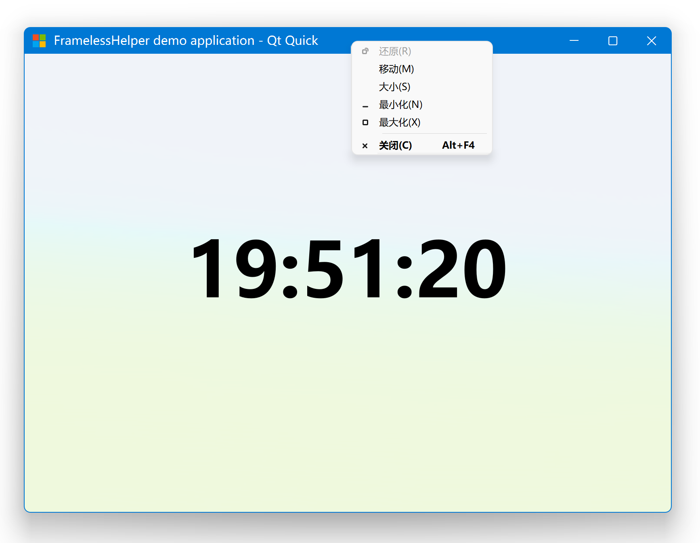

# FramelessHelper 2.x

## Join with us :triangular_flag_on_post:

You can join our [Discord channel](https://discord.gg/grrM4Tmesy) to communicate with us. You can share your findings, thoughts and ideas on improving / implementing FramelessHelper functionalities on more platforms and apps!

## Highlights compared to 2.1 (TODO list)

- Common: Added cross-platform customizable system menu for both Qt Widgets and Qt Quick. Also supports both light and dark theme.
- Common: More configurable options from environment variables and settings file.
- Common: Migrate to categorized logging output.
- Examples: Added QtWebEngine based demo projects for both Qt Widgets and Qt Quick.

## Highlights compared to 2.0

- Windows: Added support for the snap layout feature introduced in Windows 11.
- Widgets: Redesigned the public interface, the use of FramelessHelper is now more elegant.
- Quick: Redesigned the public interface, the use of FramelessHelper is now more elegant.
- Common: Redesigned the standard title bar interface, it's now possible to customize it from outside. Previously there's no standard title bar in the widgets module, it's now added and exported.
- Doc: Add initial simple documentation to show how to use this library for both Qt Widgets and Qt Quick.
- Misc: Removed bundled Qt internal classes that are licensed under Commercial/GPL/LGPL. This library is now pure MIT licensed.
- Misc: Bug fixes and internal refactorings.

## Highlights compared to 1.x

- Windows: Gained the ability to only remove the title bar but preserve the window frame at the same time.
- Windows: The flicker and jitter during window resizing is completely gone.
- Windows: The system menu will be opened if you right-click on your custom title bar.
- Windows: Replaced Qt's original system menu with FramelessHelper's homemade one, which looks a lot better than the original one.
- Linux: Removed the limitation of the Qt version. The minimum supported version is lowered to Qt 5.6 now (previously was 5.15).
- macOS: Removed the limitation of the Qt version. The minimum supported version is lowered to Qt 5.6 now (previously was 5.15).
- macOS: The frameless window now supports native resizing.
- Common: Almost completely rewritten of the whole library, it's now a lot more easier to setup your own custom title bar than before.
- Common: Added many more helper functions to allow creating your own custom window easier.
- Misc: Reorganized the project structure to be more like a modern library, it's now a lot more friendly to the library users.
- Misc: Many bugs from the 1.x times are fixed (they were not fixable in 1.x due to technical reasons).

## Screenshots

### Windows




### Linux


### macOS


## Requiredments

- Compiler: a modern compiler which supports C++17 at least. Tested on MSVC 2022 (Windows), GCC 11 (Linux) and Clang 14 (macOS).
- Qt version: using the latest stable version of Qt is highly recommended, the minimum supported version is Qt 5.6. However, if you are using some old Qt versions (such as older than 5.12), some features may not be available.
- Qt modules: QtCore and QtGui for the core module; QtWidgets for the widgets module; QtQuick, QtQuickControls2 and QtQuickTemplates2 for the quick module.
- CMake & ninja: the newer, the better. Other build systems are not tested.

## Supported platforms

- Windows: Windows 7, Windows 8, Windows 8.1, Windows 10, Windows 11
- Linux: any modern Linux distro should work, but only tested on Ubuntu 20.04 and Ubuntu 22.04
- macOS: only tested on macOS 12 due to lack of Apple devices

There are some additional restrictions for each platform, please refer to the _Platform notes_ section below.

## Build

```bash
git clone https://github.com/wangwenx190/framelesshelper.git
mkdir build
cd build
cmake -DCMAKE_PREFIX_PATH=<YOUR_QT_SDK_DIR_PATH> -DCMAKE_BUILD_TYPE=Release -GNinja ../framelesshelper
cmake --build . --config Release --target all --parallel
```

**Important note**: On Linux you need to install the _GTK3_ and _X11_ development packages first.

## Use

### Qt Widgets

To customize the window frame of a QWidget, you need to instantiate a `FramelessWidgetsHelper` object and then attach it to the widget's top level widget, and then `FramelessWidgetsHelper` will do all the rest work for you: the window frame will be removed automatically once it has been attached to the top level widget successfully. In theory you can instantiate multiple `FramelessWidgetsHelper` instances for a same widget, in this case there will be only one instance that keeps functional, all other instances will become a wrapper of that one. But to make sure everything goes smoothly and normally, you should not do that in any case. The simplest way to instantiate a `FramelessWidgetsHelper`
instance is to call the static method `FramelessWidgetsHelper *FramelessWidgetsHelper::get(QObject *)`. It will return the handle of the previously instantiated instance if any, or it will instantiate a new instance if it can't find one. It's safe to call this method multiple times for a same widget, it won't instantiate any new instances if there is one already. It also does not matter when and where you call that function as long as the top level widget is the same. The internally created instance will always be parented to the top level widget. Once you get the handle of the `FramelessWidgetsHelper` instance, you can call `void FramelessWidgetsHelper::extendsContentIntoTitleBar()` to let it hide the default title bar provided by the operating system. In order to make sure `FramelessWidgetsHelper` can find the correct top level widget, you should call the `FramelessWidgetsHelper *FramelessWidgetsHelper::get(QObject *)` function on a widget which has a complete parent-chain whose root parent is the top level widget. To make the frameless window draggable, you should provide a homemade title bar widget yourself, the title bar widget doesn't need to be in rectangular shape, it also doesn't need to be placed on the first row of the window. Call `void FramelessWidgetsHelper::setTitleBarWidget(QWidget *)` to let `FramelessHelper` know what's your title bar widget. By default, all the widgets in the title bar area won't be responsible to any mouse and keyboard events due to they have been intercepted by FramelessHelper. To make them recover the responsible state, you should make them visible to hit test. Call `void FramelessWidgetsHelper::setHitTestVisible(QWidget* )` to do that. You can of course call it on a widget that is not inside the title bar at all, it won't have any effect though. Due to Qt's own limitations, you need to make sure your widget has a complete parent-chain whose root parent is the top level widget. Do not ever try to delete the `FramelessWidgetsHelper` instance, it may still be monitoring and controlling your widget, and Qt will delete it for you automatically. No need to worry about memory leaks.

There are also two classes called `FramelessWidget` and `FramelessMainWindow`, they are only simple wrappers of `FramelessWidgetsHelper`, which just saves the call of the `void FramelessWidgetsHelper::extendsContentIntoTitleBar()` function for you. You can absolutely use plain `QWidget` instead.

#### Code

First of all, call `void FramelessHelper::Core::initialize()` in your `main` function in a very early stage:

```cpp
int main(int, char **)
{
    FramelessHelper::Core::initialize();
    // ...
}
```

Then hide the standard title bar provided by the OS:

```cpp
MyWidget::MyWidget(QWidget *parent) : QWidget(parent)
{
    // You should do this early enough.
    FramelessWidgetsHelper::get(this)->extendsContentIntoTitleBar();
    // ...
}
```

Then let `FramelessHelper` know what should be the title bar:

```cpp
void MyWidget::myFunction()
{
    // ...
    FramelessWidgetsHelper::get(this)->setTitleBarWidget(m_myTitleBarWidget);
    // ...
}
```

Then make some widgets inside your title bar visible to hit test:

```cpp
void MyWidget::myFunction2()
{
    // ...
    FramelessWidgetsHelper::get(this)->setHitTestVisible(m_someSearchBox);
    FramelessWidgetsHelper::get(this)->setHitTestVisible(m_someButton);
    FramelessWidgetsHelper::get(this)->setHitTestVisible(m_someMenuItem);
    // ...
}
```

### Qt Quick

#### Code

First of all, you should call `void FramelessHelper::Core::initialize()` in your `main` function in a very early stage:

```cpp
int main(int, char **)
{
    FramelessHelper::Core::initialize();
    // ...
}
```

Then you need to register the custom types provided by `FramelessHelper` by calling `void FramelessHelper::Quick::registerTypes(QQmlEngine *)`, before the QML engine loads any QML documents:

```cpp
int main(int, char **)
{
    // ...
    QQmlApplicationEngine engine;
    FramelessHelper::Quick::registerTypes(&engine);
    // ...
}
```

Now you can write your QML documents. You should import `FramelessHelper` from the URI `org.wangwenx190.FramelessHelper`. You should specify a version number right after it if you are using Qt5:

```qml
import org.wangwenx190.FramelessHelper 1.0 // You can use "auto" or omit the version number in Qt6.
```

And then you can use the attached properties from the QML type `FramelessHelper`:

```qml
Window {
    Item {
        id: myTitleBar
        Item { id: someControl1 }
        Item { id: someControl2 }
        Item { id: someControl3 }
        Component.onCompleted: {
            // Don't access FramelessHelper too early, otherwise it may not be able to find the root window!
            FramelessHelper.titleBarItem = myTitleBar;
            FramelessHelper.setHitTestVisible(someControl1);
            FramelessHelper.setHitTestVisible(someControl2);
            FramelessHelper.setHitTestVisible(someControl3);
        }
    }
}
```

It's the same with the `FramelessWidgetsHelper` interface, the QML type `FramelessHelper` will be instantiated only once for each `Window`, no matter when and where you use attached properties from it. However, due to the special design of the `FramelessHelper` type, you can also use it just like a normal QML type:

```qml
Window {
    Item {
        id: myTitleBar
        Item { id: someControl1 }
        Item { id: someControl2 }
        Item { id: someControl3 }
        Component.onCompleted: {
            framelessHelper.setHitTestVisible(someControl1);
            framelessHelper.setHitTestVisible(someControl2);
            framelessHelper.setHitTestVisible(someControl3);
        }
    }
    FramelessHelper {
        id: framelessHelper
        titleBarItem: myTitleBar
    }
}
```

In theory it's possible to instantiate multiple `FramelessHelper` instances for a same `Window`, in this case only one of them will keep functional, all other instances will become a wrapper of it, but doing so is not recommended and may cause unexpected behavior or bugs, so please avoid trying to do that in any case.

There's also a QML type called `FramelessWindow`, it's only a simple wrapper of `FramelessHelper`, you can absolutely use plain `Window` instead.

Please refer to the demo projects to see more detailed usages: [examples](./examples/)

### Title bar design guidance

- Microsoft: <https://docs.microsoft.com/en-us/windows/apps/design/basics/titlebar-design>
- KDE: TODO
- GNOME: TODO
- Apple: TODO

## Platform notes

### Windows

- If DWM composition is disabled in some very rare cases (only possible on Windows 7), the top-left corner and top-right corner will appear in round shape. The round corners can be restored to square if you re-enable DWM composition.
- There's an OpenGL driver bug which will cause some frameless windows have a strange black bar right on top of your homemade title bar, and it also makes the controls in your windows shifted to the bottom-right corner for some pixels. It's a bug of your graphics card driver, specifically, your OpenGL driver, not FramelessHelper. There are some solutions provided by our users but some of them may not work in all conditions, you can pick one from them:
  - Upgrade your graphics card driver to the latest version.
  - Change your system theme to "Basic".
  - If you have multiple graphics cards, try to use another one instead.
  - Force your application use the ANGLE backend instead of the Desktop OpenGL.
  - Force your application use pure software rendering instead of rendering through OpenGL.
  - Or just don't use OpenGL at all, try to use Direct3D/Vulkan/Metal instead.
- Due to there are many sub-versions of Windows 10, it's highly recommended to use the latest version of Windows 10, at least no older than Windows 10 1809. If you try to use this framework on some very old Windows 10 versions such as 1507 or 1607, there may be some compatibility issues. Using this framework on Windows 7 is also supported but not recommended. To get the most stable behavior and the best appearance, you should use it on the latest version of Windows 10 or Windows 11.
- To make the snap layout work as expected, there are some additional rules for your homemade system buttons to follow:
  - Make sure there are two public invokable functions (slot functions are always invokable): `void setHovered(bool)` and `void setPressed(bool)`. These two functions will be invoked by FramelessHelper when the button is being hovered or pressed. You should change the button's visual state inside these functions. If you need to show tooltips, you'll have to do it manually in these functions.
  - Make sure there's a public signal: `void clicked()`. When the button is being clicked, that signal will be triggered by FramelessHelper. You should connect your event handler to that signal.
  - Don't forget to call `setSystemButton()` for each button to let FramelessHelper know which is the minimize/maximize/close button.
  - System buttons will not be able to receive any actual mouse and keyboard events so there's no need to handle these events inside these buttons. That's also why we need to set the button's visual state manually.
  - I know this is making everything complicated but unfortunately we can't avoid this mess if we need to support the snap layout feature. Snap layout is really only designed for the original standard window frame, so if we want to forcely support it without a standard window frame, many black magic will be needed.

### Linux

- FramelessHelper will force your application to use the _XCB_ platform plugin when running on Wayland.
- Currently lacks runtime theme switching support due to Qt is missing the ability to detect theme change event on Linux.
- The resize area is inside of the window.

### macOS

- The frameless windows will appear in square corners instead of round corners.
- The resize area is inside of the window.

## FAQs

### `When running on Win10, it seems the top border is missing? But the demo applications still have it?`

`FramelessHelper` hides the system title bar by removing the whole top part of the window frame, including the top border. There's no way to only remove the system title bar but still preserve the top border at the same time, even Microsoft itself can't do that either. The exact reason is unknown for developers outside of Microsoft, and I have no interest in digging into all the magic behind it. So you'll have to draw one manually yourself to pretend the top border is still there. You can retrieve it's height and color through official DWM APIs. Please refer to the documentation of `DwmGetWindowAttribute()` from Microsoft: <https://docs.microsoft.com/en-us/windows/win32/api/dwmapi/nf-dwmapi-dwmgetwindowattribute>. The demo applications still have the top border because their main windows all inherit from `FramelessWidget` or `FramelessMainWindow`, which will draw the top border for you internally. As for Qt Quick, the QML type `FramelessWindow` will also draw the top border.

### `When running on Wayland, dragging the title bar causes crash?`

You need to force Qt to use the **XCB** QPA backend when running on Wayland. Try setting the environment variable `QT_QPA_PLATFORM` to `xcb` before instantiating any `Q(Gui)Application` instances. Or just call `void FramelessHelper::Core::initialize()` in your `main` function, this function will take care of it for you.

### `I can see the black background during window resizing?`

First of all, it's a Qt issue, not caused by FramelessHelper. And it should not be possible for Qt Widgets applications. It's a common issue for Qt Quick applications. Most of the time it's caused by D3D11/Vulkan/Metal because they are not good at dealing with texture resizing operations. If you really want to fix this issue, you can try to change Qt's RHI backend to **OpenGL** or **Software**. And please keep in mind that this issue is not fixable from outside of Qt.

## License

```text
MIT License

Copyright (C) 2022 by wangwenx190 (Yuhang Zhao)

Permission is hereby granted, free of charge, to any person obtaining a copy
of this software and associated documentation files (the "Software"), to deal
in the Software without restriction, including without limitation the rights
to use, copy, modify, merge, publish, distribute, sublicense, and/or sell
copies of the Software, and to permit persons to whom the Software is
furnished to do so, subject to the following conditions:

The above copyright notice and this permission notice shall be included in all
copies or substantial portions of the Software.

THE SOFTWARE IS PROVIDED "AS IS", WITHOUT WARRANTY OF ANY KIND, EXPRESS OR
IMPLIED, INCLUDING BUT NOT LIMITED TO THE WARRANTIES OF MERCHANTABILITY,
FITNESS FOR A PARTICULAR PURPOSE AND NONINFRINGEMENT. IN NO EVENT SHALL THE
AUTHORS OR COPYRIGHT HOLDERS BE LIABLE FOR ANY CLAIM, DAMAGES OR OTHER
LIABILITY, WHETHER IN AN ACTION OF CONTRACT, TORT OR OTHERWISE, ARISING FROM,
OUT OF OR IN CONNECTION WITH THE SOFTWARE OR THE USE OR OTHER DEALINGS IN THE
SOFTWARE.
```
